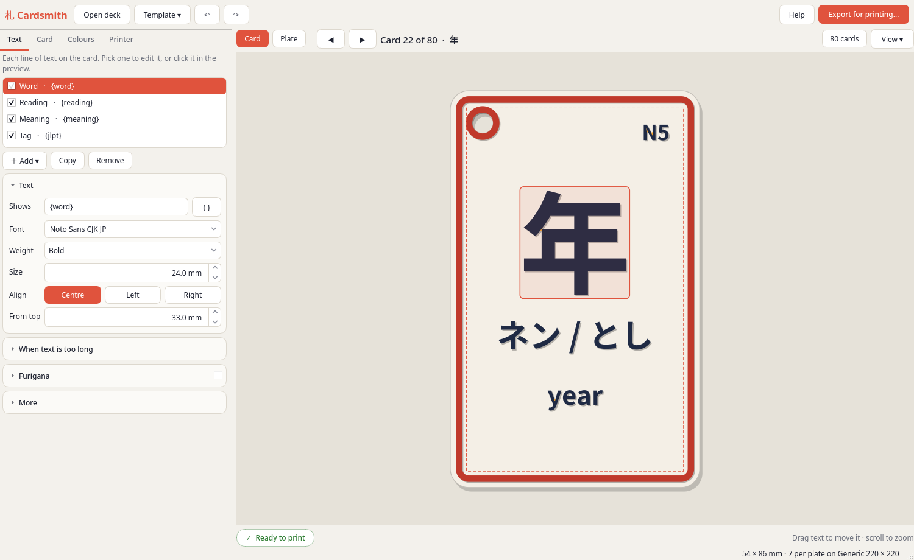
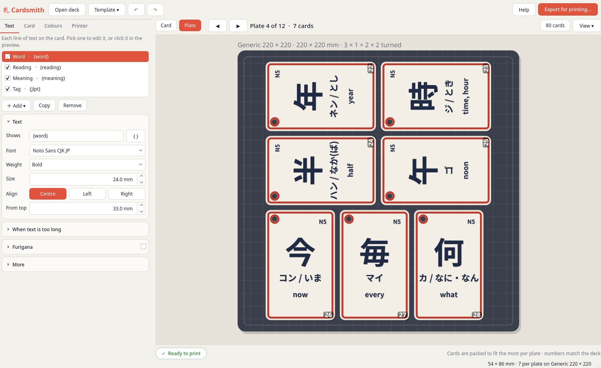
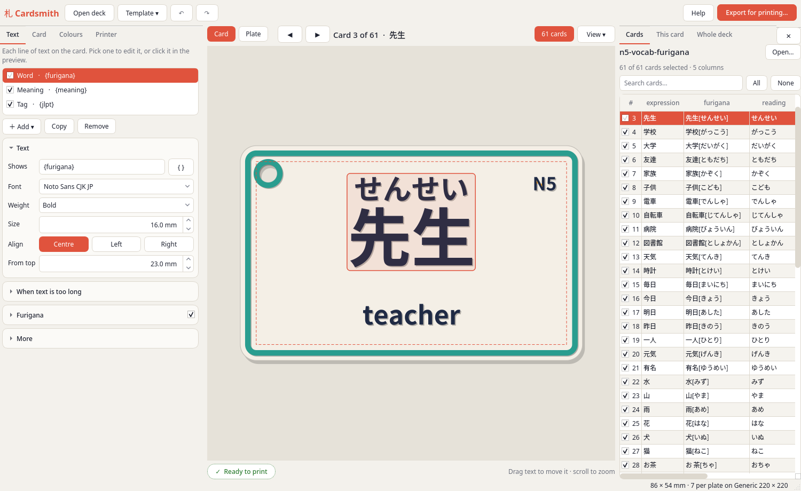
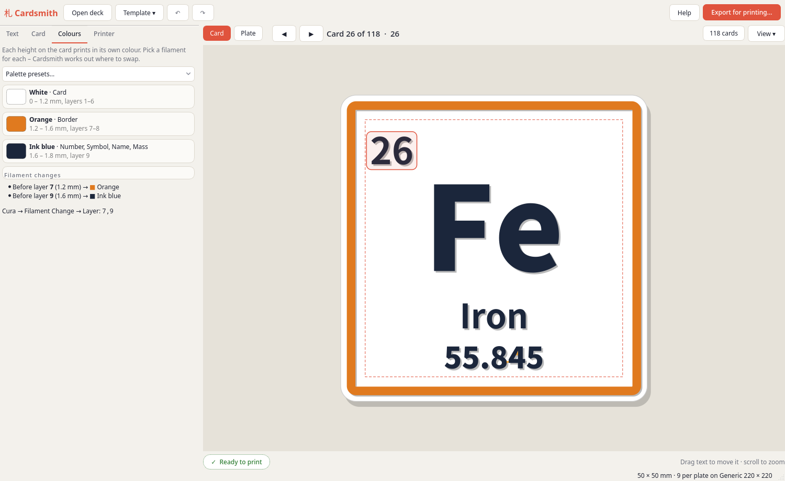
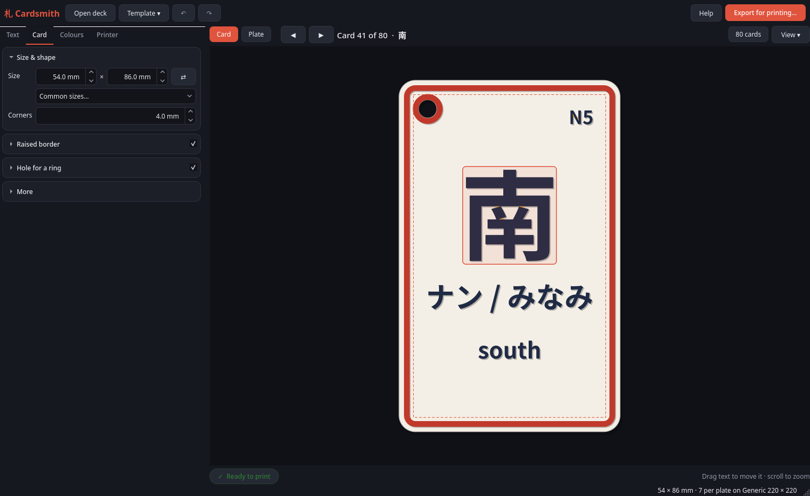
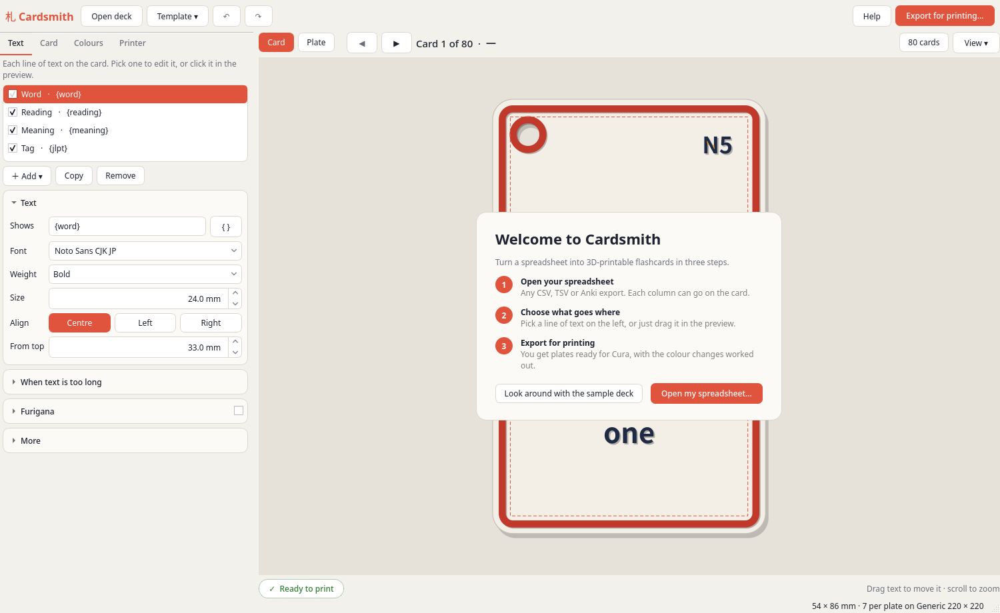
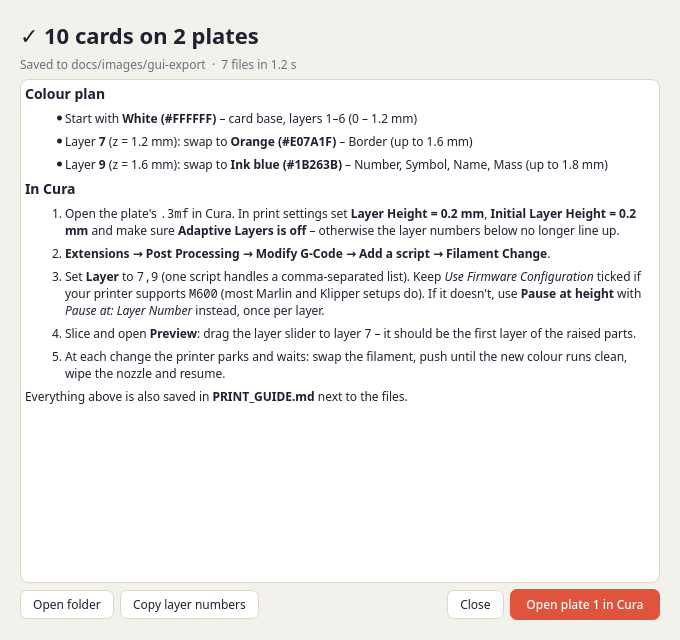
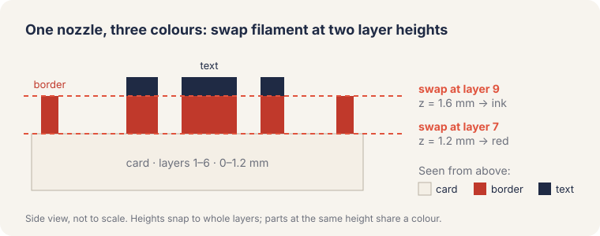

<p align="center">
  
</p>

<h1 align="center">Cardsmith</h1>

<p align="center">
  <b>Spreadsheet in, multi-colour 3D-printed flashcards out.</b><br>
  Kanji, vocab, periodic tables, anything with columns: laid out on a card, packed onto your print
  bed, and ready for Cura with the filament-change layers worked out.
</p>

<p align="center">
  <a href="https://github.com/Jackicus/cardsmith/actions/workflows/ci.yml"></a>
  
  
</p>



It's designed to be calm on first launch: a welcome card walks you through the three steps, each
tab shows only the essentials (everything else folds away under **More**), and the card list and
checks live in a drawer you open when you need them.

## What it does

- **Any data.** Open a CSV, TSV, JSON or an Anki *Notes in Plain Text* export. Every column becomes
  a field you can put on the card.
- **A live preview.** The preview uses the real glyph outlines from your fonts, so it shows exactly
  what will print. Drag text around, and long text shrinks or wraps to fit.
- **Furigana.** Write `漢字[かんじ]` (Anki style) and the reading sits above the kanji.
- **Raised text and a raised border.** Optional rounded corners and a hole for a binder ring.
- **Multi-colour on a single nozzle.** Each height is a colour band. Cardsmith tells you the exact
  layer to swap filament at, and the Cura steps to set it up.
- **Plates.** Cards are packed onto your bed to fit as many as possible, with some turned sideways
  when that squeezes more in. Deck in, `plate_01.3mf … plate_12.3mf` out.
- **Print checks.** Strokes thinner than your nozzle show up red and gaps that would fill in show
  orange, before you waste a print.
- **AMS / MMU ready.** Every plate is also exported split by colour, one object per filament.
- **Command line too.** `cardsmith build deck.tsv -t kanji -p "Bambu Lab A1"`.

<table>
<tr>
<td></td>
<td></td>
</tr>
<tr>
<td align="center">Plate view: 7 kanji cards on a 220 mm bed, 3 of them turned</td>
<td align="center">Vocab card with furigana, card list open</td>
</tr>
<tr>
<td></td>
<td></td>
</tr>
<tr>
<td align="center">Not just Japanese: periodic-table tiles</td>
<td align="center">Follows your system's dark mode</td>
</tr>
<tr>
<td></td>
<td></td>
</tr>
<tr>
<td align="center">First launch</td>
<td align="center">After export: the colour plan and Cura steps</td>
</tr>
</table>

## How the colours work



The card prints flat, from the bottom up. Swap filament at the first layer of each band and, seen
from above, the card, the border and the text each come out a different colour. To give two things
different colours, give them different heights. The **Colours** tab shows the bands, and the
exported `PRINT_GUIDE.md` lists the layers.

> The layer numbers were checked by slicing an exported plate with Cura 5.13's own CuraEngine.
> The card ends at layer 6 (1.2 mm), the first raised layer is 7 and the text-only top is 9,
> which is exactly the `7,9` Cardsmith gives.

### In Cura

1. Open `plates/plate_01.3mf`. Set **Layer Height** and **Initial Layer Height** to match the
   Printer tab, and turn **Adaptive Layers** off.
2. Go to **Extensions → Post Processing → Modify G-Code → Add a script → Filament Change**.
3. Enter the layers, e.g. `7,9`. The export window has a **Copy layer numbers** button.
4. Slice and check **Preview**: layer 7 should be the first layer of the raised parts.

If your firmware has no `M600`, use **Pause at height** (by layer number) instead.
PrusaSlicer, OrcaSlicer and Bambu Studio open the same files; add the colour changes with the **+**
on their layer slider.

## Install

You need Python 3.11+ and a font that covers your text. For Japanese, install
[Noto Sans CJK JP](https://github.com/notofonts/noto-cjk) (`fonts-noto-cjk` on Debian/Ubuntu,
`noto-fonts-cjk` on Arch).

```sh
git clone https://github.com/Jackicus/cardsmith
cd cardsmith
python -m venv .venv
.venv/bin/pip install -e ".[gui]"
.venv/bin/cardsmith            # opens the app with the sample kanji deck
```

On Linux, `scripts/install-desktop-entry.sh` adds Cardsmith to your app menu. "Open in Cura"
finds native, Flatpak and AppImage installs; set `CARDSMITH_CURA=/path/to/cura` if yours lives
somewhere else.

## Quick start

1. **Open deck…** and pick your spreadsheet (or start with the bundled JLPT N5 kanji deck).
   The **80 cards** button shows the list, where you can untick cards you don't want to print.
2. **Text** tab: each slot is a line of raised text. Set it to `{column}` with the **{ }** button,
   then pick a font, size and height. Drag it into place in the preview.
3. **Card** tab: size (presets included), thickness, corner radius, border and hole.
4. **Colours** tab: pick a filament colour per band.
5. **Printer** tab: your bed size and layer heights. Save it as a profile.
6. **Export for printing…** and drop the plates into Cura.

The **Template** menu has starting points: *Kanji flashcard*, *Vocab with furigana*, *Minimal*,
*Element tile* and *Language pair*. The [`examples/`](examples) folder has decks to go with them.

## Command line

```sh
cardsmith build examples/japanese/jlpt-n5-kanji.tsv -t kanji -p "Prusa MK4" -o out/kanji
cardsmith build deck.csv -t my-template.toml --bed 235x235 --singles    # + one STL per card
cardsmith check deck.csv -t my-template.toml                            # layout & print problems
cardsmith printers | templates | fonts --ja
```

## Templates

Templates are plain TOML, so they're easy to share, version and generate:

```toml
name = "Kanji flashcard"
palette = ["#F4EFE6", "#C0392B", "#1F2A44"]   # colour per height band, from the card up

[card]
width = 54.0
height = 86.0
thickness = 1.2
corner_radius = 4.0
padding = 3.5

[border]
width = 1.4
inset = 1.2
height = 0.4

[[slots]]
name = "Word"
text = "{word}"
font = "Noto Sans CJK JP:Bold"
size = 24.0        # em size in mm
height = 0.6       # raised above the card
y = 33.0           # centre, mm from the top edge
fit = "shrink"     # or "wrap" (with max_lines) or "none"
min_size = 9.0
```

Slot text can mix fields and fixed text, with filters:

| Write | Shows |
|---|---|
| `{word}` | the *word* column |
| `{furigana\|kanji}` | `漢字[かんじ]` → 漢字 |
| `{furigana\|kana}` | `漢字[かんじ]` → かんじ |
| `{meaning\|first}` | first item of `a; b; c` |
| `{type\|upper}` | NOUN |
| `{#}` · `{##}` | card number · total |

## Printing tips

- Bold or Black weights print best. With a 0.4 mm nozzle, keep secondary text at 4–5 mm or bigger.
- A base of 1.2 mm with 0.4–0.6 mm of relief gives sturdy cards without wasting filament.
- A textured PEI sheet gives the cards a lovely matte back.
- Turning on ironing for the top surface only smooths the raised tops.

## How it works

Fonts → glyph outlines (fontTools) → 2D layout and print checks (shapely) → watertight solids
(manifold3d) → STL / 3MF. There's no CAD package in the loop: the 80-card N5 deck builds into 12
plates in about 15 seconds. The engine has no GUI dependencies. The PySide6 app sits on top of it, and the core is
covered by 187 tests. See [CONTRIBUTING.md](CONTRIBUTING.md).

## Ideas for later

Double-sided cards (print the backs as a second job), engraved or inlaid text for single-colour
printers, QR codes linking to audio, and more templates. PRs welcome!

## License

MIT. The example decks are free to use. Kanji readings and meanings were compiled for learners,
so please open an issue if you spot a mistake.
